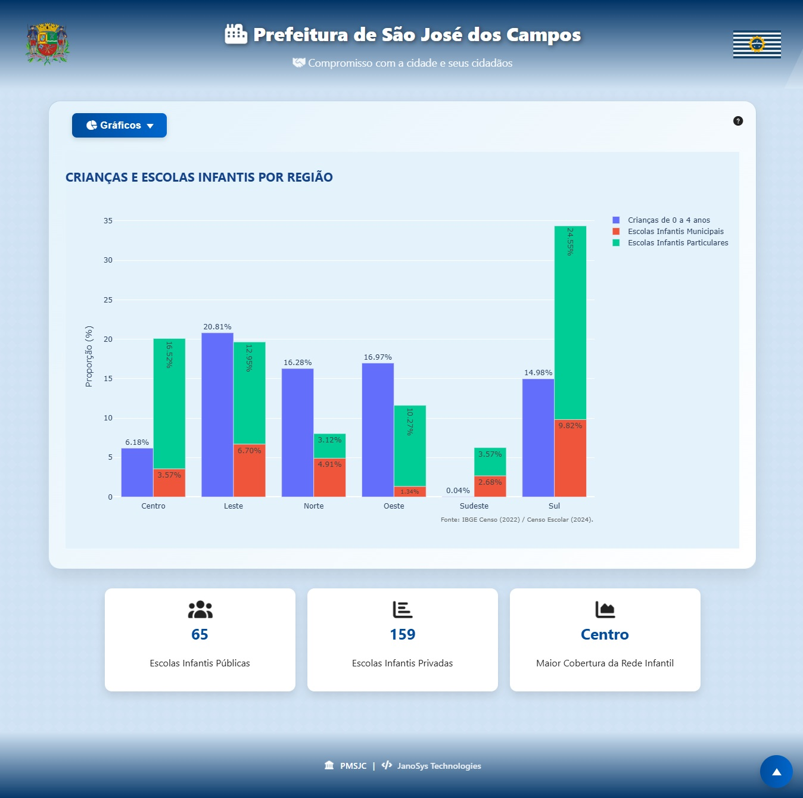

# 📌 MVP - API 1º sem. DSM 2025/2º

# Documentação (Sprint III)

      
      
"Entre o ontem e o amanhã, soluções que permanecem."

  | <a href ="#objetivo">Objetivo</a>  |
  <a href ="#descricao">Descrição</a>  |   
  <a href ="#usuario">Usuário</a>  |
  <a href ="#us">User Stories</a>  |   
  <a href ="#sprints">Sprints</a>  |
  <a href ="#criterios">Critérios</a>  | 
  <a href ="#metricas">Métricas</a>  | 
  <a href ="#feira">Feira de Soluções</a>  | 
  <a href ="#anexos">Anexos</a>  |
  <a href ="#time">Time</a> |

---

## 🎯 Objetivo do MVP 

> Qual problema resolve?

O MVP tem como objetivo central apoiar o secretário municipal de urbanismo e sustentabilidade na tomada de decisões estratégicas pela melhor distribuição dos recursos financeiros de forma eficiente entre as regiões e suas necessidades.

> Qual hipótese será validada?

Temos como premissa a validação de que com a disponibilização do site com painéis de dados interativos, os gestores públicos municipais terão uma maior clareza sobre os indicadores populacionais, permitindo decisões mais rápidas e assertivas sobre a alocação dos recursos públicos.

> Qual valor será entregue ao usuário final?

Terá como entrega um site com painéis de dados básicos, permitindo filtrar e analisar informações relevantes ao planejamento, gerando assim valor imediato na forma de melhor visualização e apoio à decisão.

---

## 📝 Descrição da Solução 

> Funcionalidades principais incluídas

<ul>
  <li> Inclusão de filtros de creches por região;</li>
  <li> Inclusão de filtros de UBS´s por região;</li>
  <li> Inclusão de gráfico com renda média por região;</li>
</ul>

> Escopo reduzido

<ul>
  <li> Entrega de um site com dashboard de dados como faixa etária, população por região, creches por região, UBS´s por região e rendimento por região;</li>
  <li> Validar com feedback se os painéis apoiam o processo de tomada de decisão do secretário e definir eventual necessidade para implantação/adaptação para Feira de Soluções.</li>
</ul>

---

## 👥 Personas / Usuários-Alvo 

- **Secretário de Urbanismo e Sustentabilidade**  Gestor público municipal responsável pelo planejamento urbano, com a necessidade de valer-se dos dados do CENSO para auxílio na melhor distribuição financeira às regiões, visto falta de ferramentas para análise de grandes volumes de dados dispersos, consolidando assim as informações.

- **População Joseense:** Moradores da cidade, diretamente impactados pelas políticas públicas e pela má distribuição dos recursos municipais, passando a receber serviços públicos como creches, mais bem distribuídos na cidade, garantindo que os recursos públicos serão aplicados de forma a suprir a demanda do crescimento populacional.

---

## 📋 User Stories (Backlog do MVP) 

| Rank | Título            | Prioridade | User Stories                                                                                                                                                       | Estimativa |
| :--: | :---------------- | :--------: | :----------------------------------------------------------------------------------------------------------------------------------------------------------------- | :--------: |
|  7   | Mensurar região com maior crescimento populacional |   ALTA    | Como secretário municipal de planejamento urbano, quero gráficos dinâmicos mensurando as regiões com maior crescimento populacional idosa, para ampliar a construção/atendimentos nas UBS´s nos bairros que mais necessitam. |     6      |   3    |

---

## 📅 Sprint(s) Relacionadas 

| Sprint |              Entregas Principais           |    Status    |
| :----: | :----------------------------------------: | :----------: |
|   01   | Criação do site                            | ✅ Concluído |
|   02   | Criação de gráficos interativos            | ✅ Concluído |
|   03   | Criação de gráficos com creches por região | ✅ Concluído |

---

## 📊 Critérios de Aceitação 

- O MVP permite que o usuário identifique a região com maior carência de creches
- Permite que o usuário identifique a quantidade de idosos e UBS´s disponíveis na região
- Permite identificar a renda média por região
- Permite identificar a região com maior crescimento populacional na cidade e suas faixas etárias
- Permite filtrar os dados por região e faixa etária
- Dados apresentados correspondem aos números oficiais
- Interface clara e de fácil navegabilidade tudo integrado em uma dashboard

---

## 📈 Métricas de Validação 

| Métrica                                |        Valor sugerido         | Valor alcançado |
| -------------------------------------- | :---------------------------: | --------------: |
| 👥 Contato da equipe com o MVP         | 100% ✅ / 80–99% ⚠️ / <80% ❌ |     **100% ✅** |
| 👍 Feedback positivo sobre usabilidade | ≥80% ✅ / 60–79% ⚠️ / <60% ❌ |      **83% ✅** |
| 📱 Feedback negativo sobre mobile      | ≤20% ✅ / 21–40% ⚠️ / >40% ❌ |      **33% ✅** |
| 📊 Precisão dos dados oficiais         | ≥80% ✅ / 80–89% ⚠️ / <80% ❌ |     **100% ✅** |
| 🌍 Precisão por região                 | ≥80% ✅ / 80–89% ⚠️ / <80% ❌ |      **87% ✅** |

## 8

## 🚀 Próximos Passos (FEIRA DE SOLUÇÕES) 

- Finalizar ajustes de UI/UX conforme novo feedback
- Aprimorar responsividade
- Refinar ajustes para apresentação na Feira de Soluções
- Reestruturar a arquitetura do site para integração com ambiente AWS utilizando containers Docker.

---

## 📂 Anexos / Evidências 

- Prints de tela / Protótipo      

- Vídeo (MVP) 

---

## 👷 Time 

|      Membro       |    Função     |                                                                        GitHub                                                                         |                                                                                    Linkedin                                                                                     |
| :---------------: | :-----------: | :---------------------------------------------------------------------------------------------------------------------------------------------------: | :-----------------------------------------------------------------------------------------------------------------------------------------------------------------------------: |
|   Wagner Costa    | Product Owner |   |     <a href="https://www.linkedin.com/in/wagner-costa-391b0726/">     |
|    Lucas Alves    | Scrum Master  |  | <a href="https://www.linkedin.com/in/lucas-da-silva-alves-18852b2b3"> |
|   Lucas Santos    |   Dev Team    |      |        <a href="https://www.linkedin.com/in/lucas-santostec/">        |
|    Pedro Chaim    |   Dev Team    |     |           <a href="https://www.linkedin.com/in/pedrochaim">           |
|    Pedro Lucas    |   Dev Team    |   |     <a href="https://www.linkedin.com/in/pedro-lucas-76870237b/">     |

---
