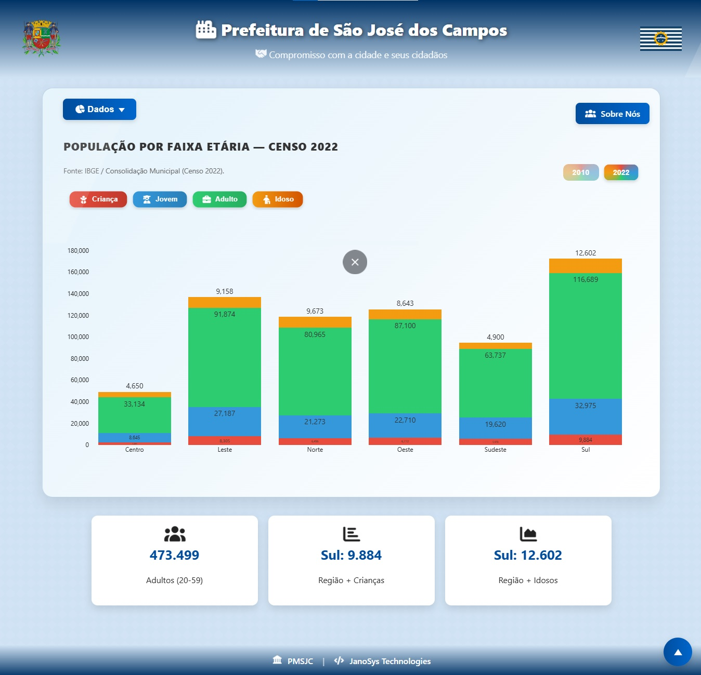
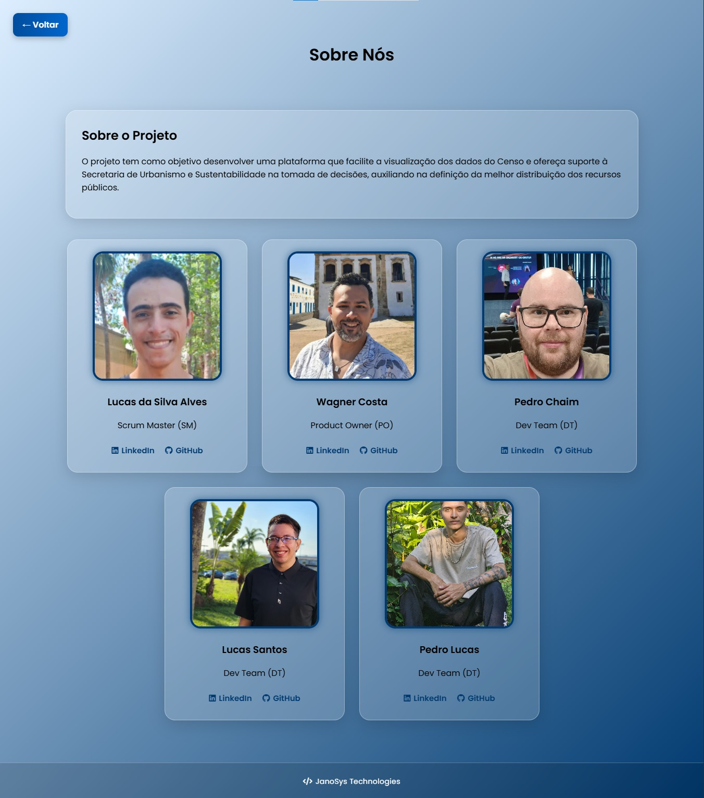

# 📌 MVP - API 1º sem. DSM 2025/2º

# Documentação (FEIRA DE SOLUÇÕES)

      
      
"Entre o ontem e o amanhã, soluções que permanecem."

  <a href ="#usuario">Usuário</a>  |
  <a href ="#sprints">Sprints</a>  |
  <a href ="#criterios">Critérios</a>  | 
  <a href ="#proximo">Próximos Passos</a>  | 
  <a href ="#anexos">Anexos</a>  |
  <a href ="#time">Time</a> |

---

## 👥 Personas / Usuários-Alvo 

- **Secretário de Urbanismo e Sustentabilidade**  Gestor público municipal responsável pelo planejamento urbano, com a necessidade de valer-se dos dados do CENSO para auxílio na melhor distribuição financeira às regiões, visto falta de ferramentas para análise de grandes volumes de dados dispersos, consolidando assim as informações.

- **População Joseense:** Moradores da cidade, diretamente impactados pelas políticas públicas e pela má distribuição dos recursos municipais, passando a receber serviços públicos como creches, mais bem distribuídos na cidade, garantindo que os recursos públicos serão aplicados de forma a suprir a demanda do crescimento populacional.

---

## 📅 Sprint(s) Relacionadas 

| Sprint |              Entregas Principais           |    Status    |
| :----: | :----------------------------------------: | :----------: |
|   01   | Criação do site                            | ✅ Concluído |
|   02   | Criação de gráficos interativos            | ✅ Concluído |
|   03   | Criação de gráficos com creches por região | ✅ Concluído |
|   04   | Deployment para a AWS usando Docker        | ✅ Concluído |

---

## 📊 Critérios de Aceitação 

- Permite identificar a região com maior crescimento populacional na cidade e suas faixas etárias
- Dados apresentados correspondem aos números oficiais
- Interface clara e de fácil navegabilidade tudo integrado em uma dashboard

---

## 🚀 Próximos Passos 

- Manter o site hospedado no Vercel como plataforma de divulgação do trabalho da equipe.

---

## 📂 Anexos / Evidências 

- Prints de tela / SITE      

- Vídeo (MVP) 

---

## 👷 Time 

|      Membro       |    Função     |                                                                        GitHub                                                                         |                                                                                    Linkedin                                                                                     |
| :---------------: | :-----------: | :---------------------------------------------------------------------------------------------------------------------------------------------------: | :-----------------------------------------------------------------------------------------------------------------------------------------------------------------------------: |
|   Wagner Costa    | Product Owner |   |     <a href="https://www.linkedin.com/in/wagner-costa-391b0726/">     |
|    Lucas Alves    | Scrum Master  |  | <a href="https://www.linkedin.com/in/lucas-da-silva-alves-18852b2b3"> |
|   Lucas Santos    |   Dev Team    |      |        <a href="https://www.linkedin.com/in/lucas-santostec/">        |
|    Pedro Chaim    |   Dev Team    |     |           <a href="https://www.linkedin.com/in/pedrochaim">           |
|    Pedro Lucas    |   Dev Team    |   |     <a href="https://www.linkedin.com/in/pedro-lucas-76870237b/">     |

---
